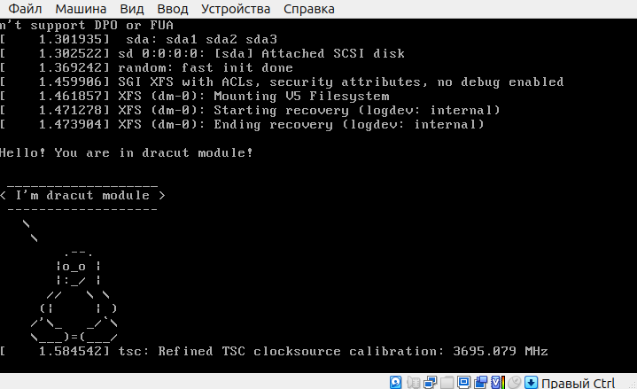

# 08. Загрузка системы


## Задание

1. Попасть в систему без пароля несколькими способами
2. Установить систему с LVM, после чего переименовать VG
3. Добавить модуль в initrd

## Script

```bash
scriptreplay --timing=timing.log --divisor=5 script.log
```

При запуске ВМ через VirtualBox GUI наблюдаем пингвина



## Tutorial

### Попасть в систему несколькими способами

#### Способ 1: **init=/bin/bash**

В меню grub нажимаем клавишу `e` в меню загрузчика.
В редакторе в команде `linux` дописываем `init=/bin/sh`.
Нажимаем Ctrl+X, система загружается с новыми параметрами и сразу получаем root-а.
Монтируем файловую систему для записи
```bash
mount -o remount,rw /
```

Создаем произвольный файл
```bash
touch /hello-world
```

#### Способ 2: **rd.break**

В редакторе в команде `linux` дописываем `rd.break`.
Нажимаем Ctrl+X, система загружается с новыми параметрами:
```bash
switch_root:/#
```
Меняем пароль администратора
```bash
mount -o remount,rw /sysroot
chroot /sysroot
passwd root
touch /.autorelabel
```
Перезагружаемся и заходим с новым паролем

#### Способ 3: **rw init=/sysroot/bin/sh**

В редакторе в команде `linux` заменяем `ro` (если есть) на `rw init=/sysroot/bin/sh`.

Нажимаем Ctrl+X, система загружается с новыми параметрами - ФС уже в режиме записи

```bash
echo 'hello world' > /hello-world
cat /hello-world
hello world
```

### Установить систему с LVM, после чего переименовать VG

```bash
vagrant init centos/7 --box-version 1804.02
vagrant up
vagrant ssh
sudo -i
vgs
vgrename VolGroup00 OtusRoot
yum install -y vim
export TERM=xterm
vim /etc/fstab
vim /etc/default/grub
vim /boot/grub2/grub.cfg
mkinitrd -f -v /boot/initramfs-$(uname -r).img $(uname -r)
exit
exit
vagrant reload
vagrant ssh
sudo -i
vgs
```

### Добавить модуль в initrd

```bash
sudo -i
mkdir /usr/lib/dracut/modules.d/01test
cd /usr/lib/dracut/modules.d/01test
wget ... -O module-setup.sh
wget ... -O test.sh
mkinitrd -f -v /boot/initramfs-$(uname -r).img $(uname -r)
lsinitrd -m /boot/initramfs-$(uname -r).img | grep test
vim /boot/grub2/grub.cfg
```
