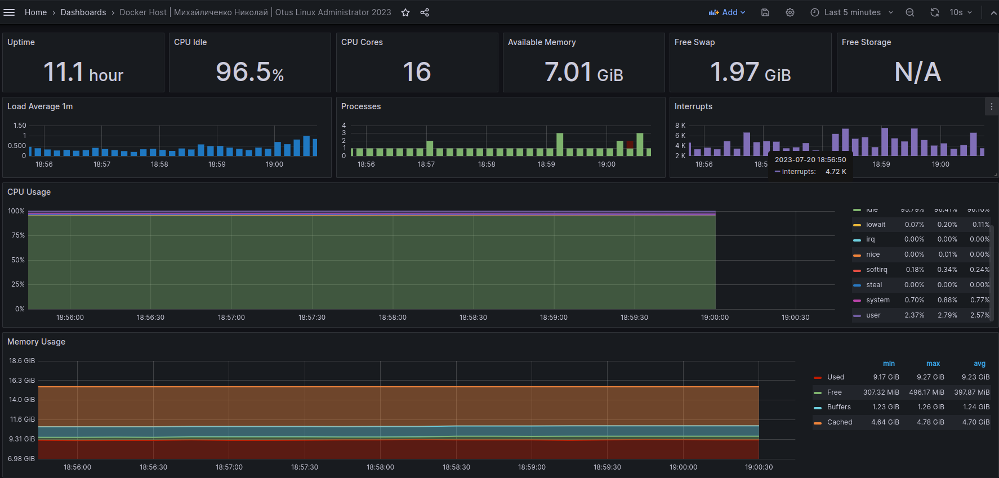
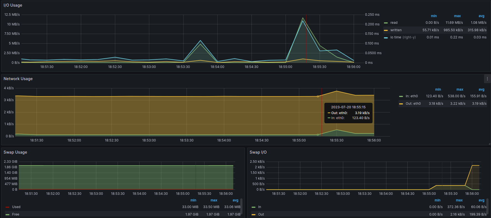

# 21. Prometheus

## Задание

Настроить дашборд с 4-мя графиками
* память;
* процессор;
* диск;
* сеть.

## Tutorial

В качестве готовой сборки prometheus + grafana + nodeexporter будем использовать проект [dockprom](https://github.com/stefanprodan/dockprom).

Проект представляет собой *docker-compose* файл с преднастроенной конфигурацией.

```bash
git clone https://github.com/stefanprodan/dockprom
cd dockprom

ADMIN_USER='admin' ADMIN_PASSWORD='admin' ADMIN_PASSWORD_HASH='$2a$14$1l.IozJx7xQRVmlkEQ32OeEEfP5mRxTpbDTCTcXRqn19gXD8YK1pO' docker-compose up -d
```

Проверяем доступность UI прометеуса: *http://localhost:9090* (логин и пароль admin/admin).

Заходим в Grafana: *http://localhost:3000* (логин и пароль admin/admin).

Переходим на панель *Docker Host* и наблюдаем метрики:

*Общая информация, ЦПУ, память*:



*Диск, сеть, swap*:


