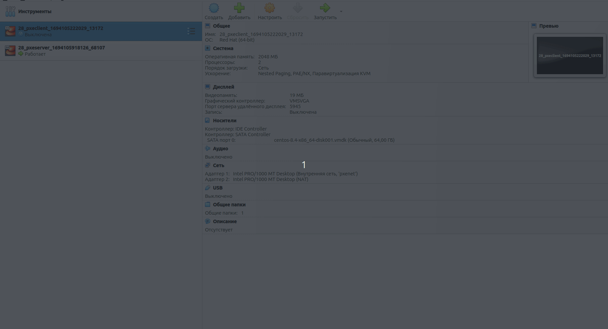

# 28. DHCP, PXE

## Задание

[Методичка](https://docs.google.com/document/d/1f5I8vbWAk8ah9IFpAQWN3dcWDHMqXzGb/edit)

1. Следуя шагам из документа https://docs.centos.org/en-US/8-docs/advanced-install/assembly_preparing-for-a-network-install
установить и настроить загрузку по сети для дистрибутива CentOS8.
В качестве шаблона воспользуйтесь репозиторием https://github.com/nixuser/virtlab/tree/main/centos_pxe.
2. Поменять установку из репозитория NFS на установку из репозитория HTTP.
3. Настроить автоматическую установку для созданного kickstart файла (*) Файл загружается по HTTP

## Script

```bash
scriptreplay --timing=timing.log --divisor=5 script.log
```

Запуск клиента с графическим установщиком (с 20й секунды)



Запуск клиент с автоматическим установщиком


## Практическая часть

Рабочая ссылка для скачивания образа Centos-8.4 - https://mirror.cs.pitt.edu/centos-vault/8.4.2105/isos/x86_64/CentOS-8.4.2105-x86_64-dvd1.iso

```bash
https://mirror.cs.pitt.edu/centos-vault/8.4.2105/isos/x86_64/CentOS-8.4.2105-x86_64-dvd1.iso
vagrant up pxeserver

# --- после успешной загрузки сервера можно запускать клиент
vagrant up pxeclient
```
