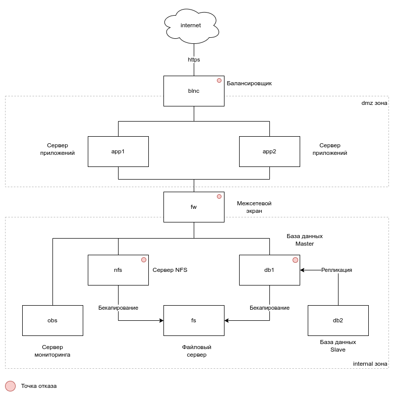

# Проектная работа

Наименование проектой работы - *Развертывание Django CMS с помощью Vagrant и Ansible*

За основу взят проект [django-cms-quickstart](https://github.com/django-cms/django-cms-quickstart).

## Схема развертывания



| Наименование сервера | Описание                                                                                                                                                                                                                                                                                                   |
| -------------------- | ---------------------------------------------------------------------------------------------------------------------------------------------------------------------------------------------------------------------------------------------------------------------------------------------------------- |
| `blnc`               | Балансировщик, терминатор HTTPS. Запросы направляются на серверы `app1` и `app2`                                                                                                                                                                                                                           |
| `app1` / `app2`      | Серверы приложений. Здесь запущены контейнеры CMS.                                                                                                                                                                                                                                                         |
| `fw`                 | Межсетевой экран. Подразумевается, что экран ограничивает доступ к *internal*-зоне из внешнего мира.                                                                                                                                                                                                       |
| `db1` / `db2`        | Серверы базы данных.                                                                                                                                                                                                                                                                                       |
| `nfs`                | Сервер сетевой файловой системы (NFS). Здесь расположены статические файлы прилоежения: картинки, видео, вложения. Директория с данными монтируется на серверы приложений `app1 / app2`, что позволяет: синхронизировать файлы между серверами приложений и бекапировать единую директорию на стороне NFS. |
| `fs`                 | Файловый сервер. Здесь складируются резервные копии БД и файлов приложений.                                                                                                                                                                                                                                |
| `obs`                | Сервер мониторинга. Запущены *prometheus*, *grafana* и сервер *loki*. На остальных серверах запущены экспортеры *Nodeexporter* и *CAdvisor*, а также *promtail* для экспорта логов.                                                                                                                        |

### База данных и репликация

В качестве базы данных приложения используется PostgreSQL 14. 
Настроена репликация: `db1` - master, `db2` - slave.

### Бекапирование и восстановление

База данных бекапируется через *cron* ежедневно. Ручное бекапирование - плейбук `ansible/database-create-backup.yaml`. Восстановление выполняется плейбуком `ansible/database-recover-latest.yaml`. В качестве инструментария используется [barman](https://pgbarman.org/).

Резеврная копия файлов приложения создается ежедневно. Ручное бекапирование - плейбук `ansible/nfs-create-backup.yaml`, восстановление - `ansible/nfs-recover-latest.yaml`. Инструментарий - [borg](https://www.borgbackup.org/).

## Быстрый старт

Редактируем */etc/hosts*, добавляем строки:

```
192.168.56.10 otus.local
192.168.56.143 grafana.local
```

Задаем пароль для хранилища секретов

```bash
echo secret > ansible/vault_pass
```

Запускаем виртуальные машины

> Полный запуск и конфигурация может занимать около *одного часа*.

```bash
vagrant up
ansible-playbook -i ansible/hosts ansible/provision.yaml
```

Заходим в админку Django CMS - [https://otus.local](https://otus.local). Логин и пароль: `admin`/`secret`.
Добавляем старницу в CMS с произвольным контентом, обязательно картинку.

Выполняем резервное копирование БД и файлов приложения:

```bash
ansible-playbook -i ansible/hosts ansible/database-create-backup.yaml -e master=db1
ansible-playbook -i ansible/hosts ansible/nfs-create-backup.yaml
```

Вход в Grafana - [https://grafana.local](https://grafana.local). Логин и пароль: `admin` / `admin`.

## План восстановления

### blnc

На данном сервере данные не сохраняются, поэтому выполняем стандартный плейбук инициализации сервера

```bash
vagrant up blnc
ansible-playbook -i ansible/hosts ansible/blnc.yaml
```

### app1 / app2

На данном сервере данные не сохраняются, поэтому выполняем стандартный плейбук инициализации сервера

```bash
vagrant up app1
# vagrant up app2
ansible-playbook -i ansible/hosts ansible/app.yaml
```

### fw

На данном сервере данные не сохраняются, поэтому выполняем стандартный плейбук инициализации сервера

```bash
vagrant up fw
ansible-playbook -i ansible/hosts ansible/fw.yaml
```

### nfs

На сервере сохранятся данные, поэтому после инициализации требуется восстановление из резервной копии.

```bash
vagrant up nfs
ansible-playbook -i ansible/hosts ansible/nfs-recover-latest.yaml
```

### db1

`db1` - мастер базы данных. На сервере сохраняются данные, поэтому требуется восстановление из резервной копии или переключение приложения на другой сервер.

#### Вариант 1. Master Recover

Предварительно должна быть сформирована резервная копия БД

```bash
vagrant up db1
ansible-playbook -i ansible/hosts ansible/firewalld-internal-config.yaml
ansible-playbook -i ansible/hosts ansible/database.yaml
ansible-playbook -i ansible/hosts ansible/barman.yaml
ansible-playbook -i ansible/hosts ansible/database-recover-latest.yaml -e master=db1 -e master_ip=10.10.1.131 -e slave=db2
```

#### Вариант 2. Slave -> Master

```bash
# --- возобновляем работу приложения
ansible-playbook -i ansible/hosts ansible/database-master-reinit.yaml -e target=db2 -e master_ip=10.10.1.132
# --- готовим новую реплику
vagrant up db1
ansible-playbook -i ansible/hosts ansible/database-slave-reinit.yaml -e target=db1 -e master=db2 -e master_ip=10.10.1.132
ansible-playbook -i ansible/hosts ansible/switch-barman-on-another-master.yaml -e master=db2
```

### db2

`db2` - slave-хост базы данных. При удалении хоста выполняем повторную инициализацию.

```bash
vagrant up db2
ansible-playbook -i ansible/hosts ansible/database-slave-reinit.yaml -e target=db2 -e master=db1 -e master_ip=10.10.1.131
```

### fs

На сервере сохраняются резервные копии БД и файлов приложения. После начальной инициализации необходимо выполнить резервное копирование.

```bash
vagrant up fs

# --- устанавливаем необходимые пакеты
ansible-playbook -i ansible/hosts ansible/barman.yaml
ansible-playbook -i ansible/hosts ansible/borg-server.yaml
ansible-playbook -i ansible/hosts ansible/borg-client.yaml
# --- бекапируем БД
ansible-playbook -i ansible/hosts ansible/database-create-backup.yaml -e master=db1
# --- или если мастер на db2
# ansible-playbook -i ansible/hosts ansible/database-create-backup.yaml -e master=db2

# --- бекапируем файлы приложения
ansible-playbook -i ansible/hosts ansible/nfs-create-backup.yaml
```

### obs

На сервере сохраняются метрики и логи. Данные не бекапируются. Для восстановления выполняем повторную инициализацию

```bash
vagrant up obs
ansible-playbook -i ansible/hosts ansible/obs.yaml
```

## Полезные команды

Создание резервной копии файлов приложения

```bash
ansible-playbook -i ansible/hosts ansible/nfs-create-backup.yaml
```

Восстановление файлов приложения из резервной копии

```bash
ansible-playbook -i ansible/hosts ansible/nfs-recover-latest.yaml
```

Создание резервной копии БД

```bash
ansible-playbook -i ansible/hosts ansible/database-create-backup.yaml -e master=db1
```

Восстановление БД из резервной копии

```bash
ansible-playbook -i ansible/hosts ansible/database-recover-latest.yaml -e master=db1 -e master_ip=10.10.1.131 -e slave=db2
```

Переключение приложения на другой сервер БД

```bash
ansible-playbook -i ansible/hosts ansible/switch-app-on-another-master.yaml -e master_ip=10.10.1.131
```
